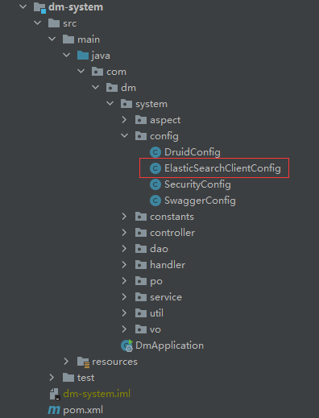
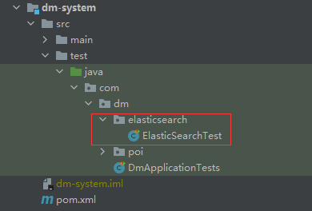

# SpringBoot整合ElasticSearch

## 返回 [README.md](../../README.md)

## 一、环境搭建

- ElasticSearch 7.12.1

## 二、引入依赖
springboot 2.3.4版本依赖的elasticsearch版本为7.6.2，修改为本地版本7.12.1
```xml
<properties>
    <!-- 本地安装的elasticsearch版本号 -->
    <elasticsearch.version>7.12.1</elasticsearch.version>
</properties>
```
```xml
<dependency>
    <groupId>org.springframework.boot</groupId>
    <artifactId>spring-boot-starter-data-elasticsearch</artifactId>
</dependency>
```

## 三、创建配置类
**(1)配置类目录**   
   
**(2)配置类代码**
```java
@Configuration
public class ElasticSearchClientConfig
{
	@Bean
	public RestHighLevelClient restHighLevelClient()
	{
		RestHighLevelClient client = new RestHighLevelClient(
				RestClient.builder(new HttpHost("127.0.0.1", 9200, "http")));
		return client;
	}
}
```

## 四、创建测试类
**(1)测试类目录**   
   
**(2)测试类代码**   
略，参照代码
